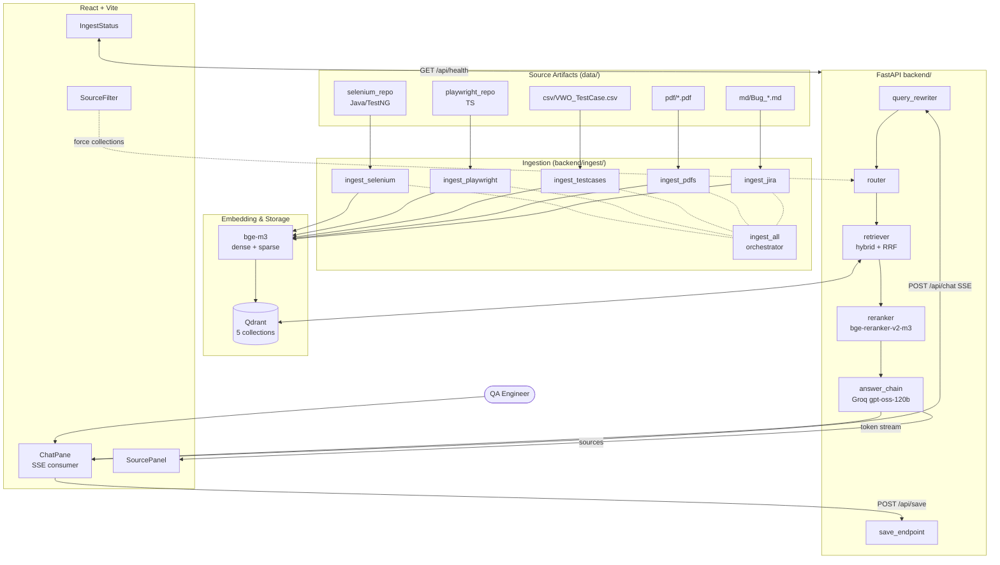

# QA Copilot — Design

## Overview

QA Copilot is a multi-source Retrieval-Augmented Generation system for QA engineers working on app.vwo.com. It indexes five heterogeneous sources (Selenium Java code, Playwright TS code, VWO test cases CSV, VWO PRD PDFs, JIRA bug Markdown) into one Qdrant vector store split across five collections, routes each user query to the most relevant collection(s) via an LLM intent classifier, retrieves with hybrid dense+sparse search, reranks with a cross-encoder, and streams a cited answer from Groq's `openai/gpt-oss-120b`.

This design document satisfies the requirements in `requirements.md` and translates them into concrete modules, data shapes, and flows. It is the contract that `tasks.md` will execute against.

### Reuse map — what Plan.md said vs. what's actually there

| Plan.md reference | Reality | Action |
|---|---|---|
| `Chapter_08_RAG/Advance_RAG_EXPLAIN/lib/embeddings.py` | Doesn't exist — patterns live in `advanced_rag_server.py` | Extract embedding pattern from that file; we upgrade Nomic → `bge-m3` |
| `Chapter_08_RAG/Advance_RAG_EXPLAIN/lib/chunking.py` | Doesn't exist — `dataframe_to_documents` + `chunk_documents` live in same file | Extract row-aware chunking pattern, port to `backend/lib/chunking_text.py` |
| `Chapter_08_RAG/Advance_RAG_EXPLAIN/ingest.py` | Doesn't exist — ingestion is the `/upload` POST handler | Pattern is good; we move it to standalone scripts |
| `Chapter_07_AI_Agent_VIBE_Coding/backend/main.py` | Doesn't exist — chapter 7 is one MD file | Build FastAPI skeleton from scratch using chapter 8's FastAPI structure |
| `Chapter_07_AI_Agent_VIBE_Coding/frontend/` | Doesn't exist | Build Vite skeleton from scratch |
| `Chapter_08_RAG/Advance_RAG_EXPLAIN/static/claude.css` | Doesn't exist | Define Tailwind theme inline |

---

## Architecture

### High-level diagram



### Layered model

```
┌─ Frontend (React + Vite + Tailwind) ────────────────────────────────┐
│  ChatPane · SourcePanel · SourceFilter · IngestStatus               │
└─────────────────────────────────────────────────────────────────────┘
                       │ HTTP / SSE
                       ▼
┌─ API layer (FastAPI) ───────────────────────────────────────────────┐
│  /api/chat (SSE)   /api/health   /api/ingest/*   /api/save          │
└─────────────────────────────────────────────────────────────────────┘
                       │
                       ▼
┌─ Orchestration (backend/lib/) ──────────────────────────────────────┐
│  retriever  ←  router  ←  query_rewriter   answer_chain   prompts   │
└─────────────────────────────────────────────────────────────────────┘
                       │
                       ▼
┌─ Storage & Models ──────────────────────────────────────────────────┐
│  qdrant_store  ·  embeddings (bge-m3)  ·  reranker (bge-rerank-v2)  │
│  Groq client (openai/gpt-oss-120b)                                  │
└─────────────────────────────────────────────────────────────────────┘
                       │
                       ▼
┌─ Ingestion (backend/ingest/) ───────────────────────────────────────┐
│  ingest_selenium · _playwright · _testcases · _pdfs · _jira · _all  │
└─────────────────────────────────────────────────────────────────────┘
                       │
                       ▼
┌─ Source artifacts (data/) ──────────────────────────────────────────┐
│  selenium_repo · playwright_repo · csv · pdf · md                   │
└─────────────────────────────────────────────────────────────────────┘
```

---

## Directory layout

```
chapter_09_Project_QACopilot/
├── README.md
├── CLAUDE.md
├── .env.example
├── .gitignore
├── docker-compose.yml          # optional Qdrant HTTP mode
├── data/
│   ├── selenium_repo/          # auto-cloned (gitignored)
│   ├── playwright_repo/        # auto-cloned (gitignored)
│   ├── csv/VWO_TestCase.csv
│   ├── pdf/*.pdf
│   ├── md/Bug_*.md
│   ├── generated/              # write-to-disk outputs (gitignored)
│   │   ├── selenium/*.java
│   │   └── playwright/*.ts
│   └── _skip_report.json       # PDF skip log (gitignored)
├── qdrant_data/                # local Qdrant file store (gitignored)
├── backend/
│   ├── __init__.py
│   ├── main.py                 # FastAPI app + endpoints
│   ├── requirements.txt
│   ├── lib/
│   │   ├── __init__.py
│   │   ├── settings.py
│   │   ├── embeddings.py
│   │   ├── reranker.py
│   │   ├── qdrant_store.py
│   │   ├── router.py
│   │   ├── retriever.py
│   │   ├── answer_chain.py
│   │   ├── query_rewriter.py
│   │   ├── session_store.py
│   │   ├── prompts.py
│   │   ├── chunking_text.py
│   │   ├── chunking_code.py
│   │   ├── chunking_md_pdf.py
│   │   └── safe_paths.py
│   └── ingest/
│       ├── __init__.py
│       ├── _git_utils.py
│       ├── ingest_selenium.py
│       ├── ingest_playwright.py
│       ├── ingest_testcases.py
│       ├── ingest_pdfs.py
│       ├── ingest_jira.py
│       └── ingest_all.py
├── frontend/
│   ├── package.json
│   ├── tsconfig.json
│   ├── vite.config.ts
│   ├── tailwind.config.js
│   ├── postcss.config.js
│   ├── index.html
│   └── src/
│       ├── main.tsx
│       ├── App.tsx
│       ├── api/
│       │   ├── client.ts
│       │   └── types.ts
│       ├── components/
│       │   ├── ChatPane.tsx
│       │   ├── MessageBubble.tsx
│       │   ├── SourcePanel.tsx
│       │   ├── SourceCard.tsx
│       │   ├── SourceFilter.tsx
│       │   ├── IngestStatus.tsx
│       │   └── SaveButton.tsx
│       └── styles/index.css
└── .kiro/specs/qa-copilot/
    ├── requirements.md
    ├── design.md
    └── tasks.md
```

---

## Data model — five Qdrant collections

All collections share this skeleton:

```python
# from qdrant_client.http.models
VectorParams(size=1024, distance=Distance.COSINE)   # dense
SparseVectorParams()                                 # sparse (bge-m3 lexical)
```

The `bge-m3` encoder produces *both* a 1024-dim dense vector and a sparse term-weight dict in one forward pass. We index both per chunk and combine at query time via Reciprocal Rank Fusion (RRF, k=60).

### Per-collection payload schema

| Field | `selenium_code` | `playwright_code` | `vwo_testcases` | `vwo_docs` | `vwo_bugs` |
|---|---|---|---|---|---|
| `text` | full chunk text (always) | ✓ | ✓ | ✓ | ✓ |
| `source_type` | `"selenium_code"` | `"playwright_code"` | `"vwo_testcases"` | `"vwo_docs"` | `"vwo_bugs"` |
| `source_path` | repo-relative path | repo-relative path | csv path | pdf path | md path |
| `repo` | `selenium_repo` | `playwright_repo` | — | — | — |
| `start_line` / `end_line` | ✓ | ✓ | — | — | — |
| `symbol` | class or method name | function/class/test name | — | — | — |
| `kind` | `class` \| `method` | `function` \| `class` \| `test` | — | — | — |
| `annotations` | TestNG `@Test` etc. (list) | — | — | — | — |
| `test_title` | — | literal arg of `test(...)` | — | — | — |
| `tc_id` | — | — | `TC_LOGIN_001` | — | — |
| `tc_name` | — | — | ✓ | — | — |
| `priority` | — | — | High/Med/Low | — | priority field |
| `precondition`, `steps`, `expected_result` | — | — | ✓ | — | — |
| `jira_id` | — | — | optional | — | `KAN-2` |
| `module`, `severity`, `labels`, `sprint`, `status`, `owner`, `test_type` | — | — | optional | — | partial |
| `doc_title`, `page`, `section` | — | — | — | ✓ | — |
| `summary`, `reporter`, `assignee`, `created`, `updated`, `project`, `components`, `type` | — | — | — | — | ✓ |
| `chunk_index` | ✓ | ✓ | ✓ | ✓ | ✓ |
| `ingested_at` | ISO timestamp | ✓ | ✓ | ✓ | ✓ |

`source_type` is duplicated even though one-collection-per-type is enforced; this keeps the data self-describing for cross-collection results.

### Point ID strategy

Stable IDs so re-ingest is idempotent (Req 20.2):

```
selenium_code   → md5("selenium:" + path + ":" + symbol + ":" + start_line)[:24]
playwright_code → md5("playwright:" + path + ":" + symbol + ":" + start_line)[:24]
vwo_testcases   → md5("tc:" + tc_id)[:24]
vwo_docs        → md5("pdf:" + source_path + ":" + page + ":" + chunk_index)[:24]
vwo_bugs        → md5("jira:" + jira_id + ":" + chunk_index)[:24]
```

Qdrant accepts hex strings as point IDs.

---

## Component design

### `lib/settings.py`

Pydantic `Settings` class loaded from `.env`. Single source of truth for config (Req 18). Uses `pydantic-settings`. Fails fast in `__init__` if `GROQ_API_KEY` is missing.

Public API:

```python
class Settings(BaseSettings):
    GROQ_API_KEY: str
    GROQ_MODEL: str = "openai/gpt-oss-120b"
    QDRANT_PATH: str | None = "./qdrant_data"
    QDRANT_URL: str | None = None
    QDRANT_API_KEY: str | None = None
    EMBED_MODEL: str = "BAAI/bge-m3"
    RERANK_MODEL: str = "BAAI/bge-reranker-v2-m3"
    EMBED_DEVICE: str = "cpu"
    SELENIUM_REPO_DIR: Path = Path("./data/selenium_repo")
    SELENIUM_REPO_URL: str = "https://github.com/PramodDutta/ATB14xSeleniumAdvanceFrameworks"
    PLAYWRIGHT_REPO_DIR: Path = Path("./data/playwright_repo")
    PLAYWRIGHT_REPO_URL: str = "https://github.com/PramodDutta/Advance-Playwright-Framework"
    TESTCASES_CSV: Path = Path("./data/csv/VWO_TestCase.csv")
    PDFS_DIR: Path = Path("./data/pdf")
    JIRA_MD_DIR: Path = Path("./data/md")
    GENERATED_DIR: Path = Path("./data/generated")
    TOP_K_PER_COLLECTION: int = 12
    RERANK_TOP_K: int = 4
    RERANK_TOP_K_SIMILARITY: int = 8     # UC2 override
    CHUNK_SIZE: int = 1000
    CHUNK_OVERLAP: int = 150
    PDF_CHUNK_SIZE: int = 800
    PDF_CHUNK_OVERLAP: int = 120
    HISTORY_TURNS: int = 4
    MIN_RERANK_SCORE: float = 0.3
    SESSION_TTL_MINUTES: int = 30

settings = Settings()  # singleton
```

### `lib/embeddings.py`

Wraps the `bge-m3` encoder via `FlagEmbedding` (the official package), exposing one method that returns both dense and sparse representations.

```python
class BGE_M3_Encoder:
    def __init__(self, model_name: str, device: str): ...
    def encode(self, texts: list[str]) -> list[BgeM3Output]:
        # returns list of {"dense": np.ndarray(1024,), "sparse": dict[int, float]}
```

Lazy-loaded singleton (`get_encoder()`). First load downloads ~2GB; cached in HF cache directory.

### `lib/reranker.py`

Wraps `BAAI/bge-reranker-v2-m3` via `FlagEmbedding.FlagReranker`.

```python
class Reranker:
    def __init__(self, model_name: str, device: str): ...
    def score(self, query: str, passages: list[str]) -> list[float]: ...
```

Lazy singleton. Cross-encoder so we batch all candidate passages in one call.

### `lib/qdrant_store.py`

Single class managing the five collections.

```python
COLLECTIONS = ["selenium_code", "playwright_code", "vwo_testcases", "vwo_docs", "vwo_bugs"]

class QdrantStore:
    def __init__(self, settings: Settings): ...
    def ensure_collection(self, name: str) -> None: ...
    def upsert(self, name: str, points: list[PointStruct]) -> None: ...
    def hybrid_search(
        self, name: str, dense: np.ndarray, sparse: dict, top_k: int
    ) -> list[ScoredPoint]: ...
    def count(self, name: str) -> int: ...
```

Construction picks file-store vs. HTTP mode based on `QDRANT_URL`. Idempotent `ensure_collection` (Req 7.5/7.6). Hybrid search uses Qdrant's native `prefetch + fusion` API (Qdrant ≥1.10) which performs RRF server-side, OR falls back to two `query_points` calls + client-side RRF if the version doesn't support it (we'll document the version requirement).

### `lib/chunking_text.py`

Row-aware CSV chunking, ported from `Chapter_08_RAG/Advance_RAG_Explain/advanced_rag_server.py:dataframe_to_documents`. Each test case row → one chunk; we don't sub-split because rows are short.

```python
def chunk_testcase_row(row: dict) -> ChunkRecord: ...
def parse_jira_markdown(path: Path) -> tuple[dict, str]:  # (metadata, body)
    """Parse the [KAN-N] header block from JIRA MD exports."""
def chunk_jira_body(metadata: dict, body: str, chunk_size: int, overlap: int) -> list[ChunkRecord]:
    """One chunk if body ≤ 1500 chars else split with langchain RecursiveCharacterTextSplitter."""
```

### `lib/chunking_code.py`

AST-aware chunking using `tree_sitter_languages` (provides pre-built wheels for many languages, includes `java` and `typescript`).

```python
def chunk_java_file(path: Path) -> list[ChunkRecord]:
    """One chunk per top-level class and per method.
       Captures class name, method name, line range, TestNG annotations."""

def chunk_ts_file(path: Path) -> list[ChunkRecord]:
    """One chunk per function/class/`test(...)` block.
       Captures symbol, kind, optional test_title."""
```

Tree-sitter queries used:

```
;; Java
(class_declaration name: (identifier) @class_name) @class_node
(method_declaration name: (identifier) @method_name) @method_node
(annotation name: (identifier) @annotation) @annotation_node

;; TypeScript / JavaScript
(function_declaration name: (identifier) @fn_name) @fn_node
(class_declaration name: (identifier) @class_name) @class_node
(call_expression
  function: (identifier) @callee
  arguments: (arguments . (string) @title)
  (#eq? @callee "test")) @test_node
```

### `lib/chunking_md_pdf.py`

```python
def extract_pdf_text(path: Path) -> list[tuple[int, str]]:
    """Returns [(page_number, page_text), ...] using PyMuPDF."""

def split_pdf_text(
    pages: list[tuple[int, str]], chunk_size: int, overlap: int
) -> list[ChunkRecord]:
    """Header-aware splitter using langchain RecursiveCharacterTextSplitter
       with separators=['\\n# ', '\\n## ', '\\n### ', '\\n\\n', '\\n', '. ', ' ', ''].
       Preserves source page in each chunk."""

def is_pdf_too_short(pages: list[tuple[int, str]]) -> bool:
    """Total extracted chars < 50."""
```

### `lib/router.py` — intent routing

```python
ALLOWED = {"selenium_code", "playwright_code", "vwo_testcases", "vwo_docs", "vwo_bugs"}

ROUTER_SYSTEM = """You are a router that picks 1-2 source collections for a QA query.
Available collections:
- selenium_code: Java/TestNG framework code (page objects, helpers, test classes)
- playwright_code: TypeScript Playwright framework (fixtures, specs, page objects)
- vwo_testcases: Manual test case specifications for app.vwo.com login flows
- vwo_docs: VWO product PRDs and feature specs (PDFs)
- vwo_bugs: JIRA bug exports (KAN-N tickets)

Examples:
Q: Show how login fixture is set up in Playwright
A: ["playwright_code"]
Q: List P0 test cases for login
A: ["vwo_testcases"]
Q: Generate Selenium code for TC_LOGIN_009
A: ["vwo_testcases", "selenium_code"]
Q: What does the PRD say about 2FA?
A: ["vwo_docs"]
Q: Open bugs for login failures
A: ["vwo_bugs"]
Q: Generate test cases from KAN-3
A: ["vwo_bugs", "vwo_testcases"]

Return ONLY a JSON array of 1 or 2 collection names. No prose.
"""

def route(query: str, force: list[str] | None) -> list[str]:
    if force:
        return [c for c in force if c in ALLOWED]
    raw = groq_chat(model=settings.GROQ_MODEL, system=ROUTER_SYSTEM, user=query, temperature=0)
    try:
        picks = json.loads(extract_json_array(raw))
        picks = [c for c in picks if c in ALLOWED]
        return picks[:2] if picks else list(ALLOWED)   # fallback: all five
    except Exception:
        return list(ALLOWED)
```

### `lib/query_rewriter.py`

```python
REWRITE_SYSTEM = """Rewrite the user's latest question into a standalone query
that includes any context implied by recent conversation. Output ONLY the
rewritten query, no preamble."""

def rewrite(history: list[Turn], latest: str) -> str:
    if not history:
        return latest
    convo = format_history(history[-settings.HISTORY_TURNS:])
    return groq_chat(REWRITE_SYSTEM, f"{convo}\nLatest: {latest}", temperature=0).strip()
```

### `lib/retriever.py`

```python
class Retriever:
    def __init__(self, store: QdrantStore, encoder: BGE_M3_Encoder, reranker: Reranker): ...

    def retrieve(
        self,
        query: str,
        collections: list[str],
        rerank_top_k: int = settings.RERANK_TOP_K,
    ) -> list[ScoredChunk]:
        # 1. embed query (dense + sparse)
        emb = self.encoder.encode([query])[0]

        # 2. parallel hybrid search per collection
        with ThreadPoolExecutor() as pool:
            results_per = pool.map(
                lambda c: self.store.hybrid_search(
                    c, emb["dense"], emb["sparse"],
                    top_k=settings.TOP_K_PER_COLLECTION
                ),
                collections,
            )
        merged = list(itertools.chain(*results_per))

        # 3. rerank
        if not merged:
            return []
        scores = self.reranker.score(query, [p.payload["text"] for p in merged])
        scored = sorted(zip(merged, scores), key=lambda x: x[1], reverse=True)

        # 4. top-k with min-score gate (UC2)
        out = [ScoredChunk(p, s) for (p, s) in scored[:rerank_top_k]
               if s >= settings.MIN_RERANK_SCORE]
        return out or [ScoredChunk(scored[0][0], scored[0][1])]   # at least 1
```

### `lib/answer_chain.py`

```python
ANSWER_SYSTEM = """You are QA Copilot, an expert QA engineer assistant for app.vwo.com.

You are given context chunks tagged like:
<doc id="1" source_type="..." source_path="..." ...metadata...>
text
</doc>

Rules:
- Ground every claim in the provided context. Cite each claim with [N] where N is the doc id.
- If the context is insufficient, say so explicitly. Do not invent.
- For test case generation: output rows in CSV format with columns Test Case ID, Test Case Name, Precondition, Test Steps, Expected Result, Priority.
- For code generation: output a complete file in a fenced ```java or ```typescript block, matching the conventions visible in the cited code chunks (page objects, base classes, fixtures, naming).
- For similarity searches: list each hit as a bullet "TC_ID — Name — one-line summary [N]".
"""

async def stream_answer(
    user_query: str,
    rewritten_query: str,
    history: list[Turn],
    chunks: list[ScoredChunk],
    use_case_hint: str | None,    # "generate_tc" | "find_similar" | "generate_code" | None
) -> AsyncIterator[StreamEvent]:
    context_blocks = render_context(chunks)
    messages = build_messages(ANSWER_SYSTEM, history, user_query, context_blocks, use_case_hint)
    yield StreamEvent.sources(chunks_to_citations(chunks))
    async for token in groq_stream(messages):
        yield StreamEvent.token(token)
    yield StreamEvent.done()
```

`use_case_hint` is detected by simple regex on the rewritten query (e.g., `\bsimilar\b|\bdo we have\b` → `find_similar`). Used to nudge the system prompt and pick `RERANK_TOP_K_SIMILARITY` for UC2.

### `lib/session_store.py`

In-memory dict keyed by `session_id`, each value is `{ "history": list[Turn], "last_seen": datetime, "last_chunks": list[ScoredChunk], "last_message_id": str }`. A background task in `main.py` evicts entries older than `SESSION_TTL_MINUTES`. `last_chunks` is what `/api/save` reads when the user clicks "Save to disk".

### `lib/safe_paths.py`

```python
ALLOWED_WRITE_DIRS = [settings.GENERATED_DIR.resolve(), settings.TESTCASES_CSV.parent.resolve()]

def safe_resolve(target: str | Path) -> Path:
    p = (Path.cwd() / target).resolve()
    if any(str(p).startswith(str(d)) for d in ALLOWED_WRITE_DIRS):
        return p
    raise PermissionError(f"Refusing to write outside allowed dirs: {p}")
```

Used by `/api/save`.

---

## Ingestion design

### Common pattern (every ingest script)

```python
def main():
    settings = get_settings()
    store = QdrantStore(settings)
    encoder = get_encoder()
    store.ensure_collection(COLLECTION_NAME)

    chunks: list[ChunkRecord] = build_chunks()    # script-specific
    if not chunks:
        print(f"{COLLECTION_NAME}: 0 chunks (nothing to ingest)")
        return

    points = []
    for batch in batched(chunks, 32):
        texts = [c.text for c in batch]
        embs = encoder.encode(texts)
        for c, e in zip(batch, embs):
            points.append(PointStruct(
                id=stable_id(c),
                vector={"dense": e["dense"], "sparse": SparseVector(**e["sparse"])},
                payload=c.payload,
            ))
    store.upsert(COLLECTION_NAME, points)
    print(f"{COLLECTION_NAME}: {len(points)} chunks from {n_sources} sources")
```

### `ingest/_git_utils.py`

```python
def ensure_repo(local_dir: Path, url: str, log) -> None:
    if not local_dir.exists() or not (local_dir / ".git").exists():
        log(f"Cloning {url} → {local_dir}")
        subprocess.check_call(["git", "clone", url, str(local_dir)])
    else:
        log(f"Pulling latest in {local_dir}")
        subprocess.check_call(["git", "-C", str(local_dir), "pull", "--ff-only"])
```

### `ingest/ingest_all.py`

Orchestrator (Req 6):

```python
STEPS = [
    ("selenium",   ingest_selenium.main),
    ("playwright", ingest_playwright.main),
    ("testcases",  ingest_testcases.main),
    ("pdfs",       ingest_pdfs.main),
    ("jira",       ingest_jira.main),
]

def run() -> int:
    failures = []
    for name, fn in STEPS:
        try:
            fn()
        except Exception:
            traceback.print_exc()
            failures.append(name)
    print_summary_table()
    return 0 if not failures else 1
```

---

## API design

### `POST /api/chat` — chat with SSE streaming

Request body:
```json
{
  "session_id": "abc-123",
  "message": "Generate Playwright code for TC_LOGIN_001",
  "force_collections": null,
  "framework": "playwright"
}
```

Response: `text/event-stream`. Three event types:

```
event: sources
data: {"sources": [{"id": 1, "source_type": "vwo_testcases", "tc_id": "TC_LOGIN_001", ...}, ...], "message_id": "msg-456"}

event: token
data: {"text": "import"}

event: token
data: {"text": " { test"}

event: done
data: {"message_id": "msg-456"}
```

Order: `sources` first (one event), then `token` events, then `done`. The frontend uses `message_id` to wire the "Save to disk" button.

Server logic:

```python
@app.post("/api/chat")
async def chat(req: ChatRequest):
    session = sessions.get_or_create(req.session_id)
    rewritten = query_rewriter.rewrite(session.history, req.message)
    use_case = detect_use_case(rewritten, req.framework)
    collections = router.route(rewritten, req.force_collections, use_case)
    chunks = retriever.retrieve(rewritten, collections, rerank_top_k_for(use_case))

    message_id = uuid()
    session.last_message_id = message_id
    session.last_chunks = chunks

    async def gen():
        yield sse("sources", {"sources": [c.to_citation() for c in chunks], "message_id": message_id})
        full = []
        async for tok in answer_chain.stream_answer(...):
            full.append(tok)
            yield sse("token", {"text": tok})
        session.append(Turn(req.message, "".join(full)))
        yield sse("done", {"message_id": message_id})

    return StreamingResponse(gen(), media_type="text/event-stream")
```

### `GET /api/health`

```json
{
  "status": "ok",
  "collections": {
    "selenium_code": 412,
    "playwright_code": 187,
    "vwo_testcases": 50,
    "vwo_docs": 23,
    "vwo_bugs": 2
  },
  "groq_model": "openai/gpt-oss-120b",
  "embed_model": "BAAI/bge-m3",
  "rerank_model": "BAAI/bge-reranker-v2-m3"
}
```

### `POST /api/ingest/{source}`

`source` ∈ `{selenium, playwright, testcases, pdfs, jira, all}`. Runs the corresponding script in a thread pool (so the request doesn't block the event loop) and returns the printed summary.

### `POST /api/save`

Request:
```json
{ "message_id": "msg-456", "framework": "playwright", "tc_id": "TC_LOGIN_001", "overwrite": false }
```

Logic:
1. Look up session by message_id.
2. Determine target path based on use case detected at chat time:
   - UC1 (generate TCs) → append rows to `data/csv/VWO_TestCase_generated.csv`
   - UC3 (generate code) → `data/generated/<framework>/<tc_id>.<java|ts>`
3. Run `safe_resolve` (path traversal guard).
4. Refuse if file exists and `overwrite=False`.
5. Extract the fenced code block (UC3) or CSV rows (UC1) from the cached assistant message.
6. Write file. Return `{ "written_path": "..." }`.

---

## Frontend design

### State model

```ts
type Session = { id: string };

type Citation = {
  id: number;
  source_type: "selenium_code" | "playwright_code" | "vwo_testcases" | "vwo_docs" | "vwo_bugs";
  // discriminated union by source_type for typed rendering
  ...
};

type Message = {
  id: string;
  role: "user" | "assistant";
  text: string;
  citations?: Citation[];
  saveable?: { kind: "csv" | "code"; framework?: "selenium" | "playwright"; tc_id?: string };
};

type AppState = {
  session: Session;
  messages: Message[];
  forceCollections: string[];   // [] = let router decide
  framework: "selenium" | "playwright" | "auto";
  ingestStatus: Record<string, number>;
};
```

### Three-pane layout

`App.tsx` renders:

```
┌──────────────────┬─────────────────────────────┬──────────────────┐
│ Sidebar          │ ChatPane                    │ SourcePanel      │
│ ─ SourceFilter   │ ─ message list (markdown)   │ ─ SourceCard×N   │
│ ─ IngestStatus   │ ─ input + Send + framework  │   (cited chunks) │
└──────────────────┴─────────────────────────────┴──────────────────┘
```

### `ChatPane.tsx`

- Maintains `messages` state.
- On submit, opens a `fetch` POST and reads the response body as a stream (the standard `EventSource` API only supports GET; we'll parse SSE manually with `ReadableStream`).
- For each `event: token`, append to the in-progress assistant message.
- For `event: sources`, attach citations to the message.
- Renders Markdown via `react-markdown` with a `remark-gfm` plugin and `rehype-highlight` (or `react-syntax-highlighter`) for `java` and `typescript` fenced blocks.
- `[N]` markers in the rendered Markdown are post-processed: a custom `remark` plugin (or simple regex DOM walk) wraps each `[N]` in a `<button class="citation-chip">` that calls `scrollSourceIntoView(N)`.

### `SourcePanel.tsx` and `SourceCard.tsx`

- Receives the latest message's `citations`.
- Renders a `SourceCard` per citation, formatted by `source_type`:
  - `selenium_code` / `playwright_code`: header `repo · path:start–end · symbol`, expandable to full text.
  - `vwo_testcases`: header `tc_id · tc_name · priority`, body shows steps and expected.
  - `vwo_docs`: header `doc_title · page N · section`, expandable.
  - `vwo_bugs`: header `jira_id · status · priority · summary`, expandable.
- A `ref` map on cards lets `ChatPane` scroll to a card when the user clicks a `[N]` chip; the card flashes a Tailwind `ring-2 ring-amber-400` for ~800ms.

### `SourceFilter.tsx`

Five checkboxes (one per collection). Selected collections become the `force_collections` array on the next `/api/chat` request, overriding the router (Req 9.4).

### `IngestStatus.tsx`

- On mount, calls `GET /api/health` and renders chunk counts per collection.
- Has five "Re-ingest" buttons that POST to `/api/ingest/{source}`. While running, shows a spinner; on response, refreshes counts.
- One "Re-ingest all" button that hits `/api/ingest/all`.

### `SaveButton.tsx`

Appears under any assistant message whose `saveable` is set. On click, POSTs to `/api/save`, then shows a green toast with the absolute path.

### Vite config

```ts
// vite.config.ts
export default defineConfig({
  plugins: [react()],
  server: {
    port: 5173,
    proxy: {
      "/api": {
        target: "http://localhost:8000",
        changeOrigin: true,
        // SSE needs streaming preserved
        configure: (proxy) => proxy.on("proxyReq", (preq) => preq.setHeader("Accept", "text/event-stream")),
      },
    },
  },
});
```

---

## Use case flow walk-throughs

### UC1 — JIRA → new test cases

```
User: "Create test cases from KAN-3"
  ↓ rewrite (no history) → "Create test cases from KAN-3"
  ↓ router → ["vwo_bugs", "vwo_testcases", "vwo_docs"]   # router prompt example covers this
  ↓ retriever → 12+12+12 candidates → rerank → top 4
  ↓ use_case = "generate_tc" → answer prompt biased toward CSV row format
  ↓ Groq stream → CSV rows + [N] cites
  ↓ frontend marks message saveable={kind:"csv"}
  ↓ user clicks Save → POST /api/save → appends to data/csv/VWO_TestCase_generated.csv
```

### UC2 — Find similar test cases

```
User: "Do we already have a test for SQL injection in password?"
  ↓ rewrite → same
  ↓ regex detects "do we have" → use_case = "find_similar"
  ↓ router → ["vwo_testcases"]
  ↓ retriever with rerank_top_k=8 → if top score < 0.3 emit "no close match"
  ↓ answer formatted as bullets "TC_ID — Name — summary [N]"
```

### UC3 — Manual TC → automation code

```
User: "Generate Playwright code for TC_LOGIN_009" + framework=playwright
  ↓ rewrite → same
  ↓ keyword "Generate ... code" → use_case = "generate_code"
  ↓ router → ["vwo_testcases", "playwright_code"]   # framework dictates the code collection
  ↓ retriever → top 4 (1 testcase chunk + ~3 framework code chunks)
  ↓ answer prompt biased toward complete file output
  ↓ Groq stream → ```typescript fenced block + [N] cites
  ↓ frontend marks message saveable={kind:"code", framework:"playwright", tc_id:"TC_LOGIN_009"}
  ↓ user clicks Save → POST /api/save → writes data/generated/playwright/TC_LOGIN_009.ts (refuses to overwrite)
```

---

## Error handling

| Failure mode | Where | Behavior |
|---|---|---|
| Missing `GROQ_API_KEY` | startup | Backend exits 1 with clear message |
| Groq rate-limit | `answer_chain` | Exponential backoff (1s, 2s, 4s), 3 retries, then SSE `error` event |
| Groq 5xx | `answer_chain` | Same backoff |
| Qdrant collection mismatch | `ensure_collection` | Raise `RuntimeError` with instruction to delete `qdrant_data/` |
| Tree-sitter parse error | `chunking_code` | Log warning with file path, skip file, continue |
| PDF empty / unreadable | `chunking_md_pdf` | Append entry to `data/_skip_report.json`, skip |
| JIRA MD missing header block | `chunking_text.parse_jira_markdown` | Fall back to filename-derived `jira_id`, log warning |
| Router returns malformed JSON | `router.route` | Fall back to all-five collections |
| Reranker score below threshold | `retriever` | Still return top-1 to avoid empty answers; UC2 surfaces the warning |
| User-supplied save path traversal | `/api/save` via `safe_resolve` | 400 with reason |
| Save target exists, no overwrite | `/api/save` | 409 Conflict with `existing_path` |
| Frontend SSE connection drop | `ChatPane` | Mark message `[truncated]`, show retry button |

---

## Configuration & deployment

### Local dev (default)

```
# 1. Python deps
python -m venv .venv && .venv\Scripts\activate.bat   (Windows) / source .venv/bin/activate
pip install -r backend/requirements.txt

# 2. Env
copy .env.example .env  # then add GROQ_API_KEY

# 3. Ingest
python -m backend.ingest.ingest_all

# 4. Backend
uvicorn backend.main:app --reload --port 8000

# 5. Frontend (separate terminal)
cd frontend
npm install
npm run dev   # opens http://localhost:5173
```

### Optional: Qdrant HTTP mode via Docker

`docker-compose.yml`:

```yaml
services:
  qdrant:
    image: qdrant/qdrant:v1.11.0
    ports:
      - "6333:6333"
    volumes:
      - ./qdrant_data:/qdrant/storage
```

Then in `.env`:
```
QDRANT_URL=http://localhost:6333
# QDRANT_PATH unused
```

### Required Python deps (`backend/requirements.txt`)

```
fastapi==0.115.0
uvicorn[standard]==0.30.6
pydantic==2.9.2
pydantic-settings==2.5.2
python-dotenv==1.0.1
python-multipart==0.0.9
httpx==0.27.2
groq==0.11.0
qdrant-client==1.11.3
FlagEmbedding==1.2.10
sentence-transformers==3.0.1
torch>=2.2.0
PyMuPDF==1.24.10
pandas==2.2.2
langchain-text-splitters==0.2.4
tree-sitter==0.21.3
tree-sitter-languages==1.10.2
GitPython==3.1.43
```

### Required JS deps (`frontend/package.json`)

```
"dependencies": {
  "react": "^18.3.1",
  "react-dom": "^18.3.1",
  "react-markdown": "^9.0.1",
  "remark-gfm": "^4.0.0",
  "react-syntax-highlighter": "^15.5.0",
  "lucide-react": "^0.453.0"
},
"devDependencies": {
  "vite": "^5.4.10",
  "@vitejs/plugin-react": "^4.3.3",
  "typescript": "^5.6.3",
  "tailwindcss": "^3.4.14",
  "postcss": "^8.4.47",
  "autoprefixer": "^10.4.20",
  "@types/react": "^18.3.12",
  "@types/react-dom": "^18.3.1"
}
```

---

## Testing strategy

Per the goal section, tests aren't auto-added. The following is the recommended manual smoke set, runnable with `curl` or via the UI:

- `selenium_code`: "Show the BasePage waitForElement implementation"
- `playwright_code`: "How is the login fixture set up in Playwright?"
- `vwo_testcases`: "List all High priority test cases for SQL injection scenarios"
- `vwo_docs`: "What does the PRD say about login dashboard auth flow?"
- `vwo_bugs`: "Show open bugs related to login failures"

Each must produce inline `[N]` citations and matching `SourcePanel` cards with the right metadata.

---

## Open assumptions (carry-over from requirements.md)

- CSV currently has 50 rows; design scales to several thousand without changes.
- `data/md/` only contains JIRA-style bug exports; if other markdown doc types appear, `ingest_jira.py` needs a parser branch.
- Playwright repo is TS; `tree-sitter-typescript` parses both `.ts` and `.js`.
- Local-only is the default; HTTP Qdrant + GPU is a documented switch, not the default.
- The Markdown JIRA exports are the source of truth for bugs; live Jira REST integration is explicitly out of scope.
