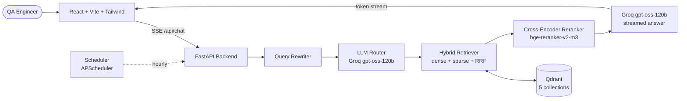

# Chapter 9 — QA Copilot: Multi-Source RAG

A Retrieval-Augmented Generation copilot for QA engineers working on **app.vwo.com**. Ask natural-language questions and get cited answers grounded in five heterogeneous QA artifacts.

## What it does

QA Copilot serves three core use cases for QA engineers:

| # | Input | Output |
|---|---|---|
| **UC1** | A JIRA ticket or feature description | New test cases in CSV format, optionally written to disk |
| **UC2** | A scenario description | Existing test cases that already cover it (deduplication) |
| **UC3** | A manual test case + framework choice | Selenium (Java/TestNG) or Playwright (TypeScript) automation code, optionally written to disk |

Every answer includes inline `[N]` citations linking back to the exact source chunk (file path with line numbers, test case ID, JIRA ticket, or PDF page).

## Architecture



**Five Qdrant collections (one per source type):**

| Collection | Source | Chunking strategy |
|---|---|---|
| `selenium_code` | Java/TestNG repo (auto-cloned) | tree-sitter AST — one chunk per class/method |
| `playwright_code` | TypeScript repo (auto-cloned) | tree-sitter AST — one chunk per function/class/test |
| `vwo_testcases` | `data/csv/VWO_TestCase.csv` (50 login TCs) | one chunk per row |
| `vwo_docs` | `data/pdf/*.pdf` (PRDs) | PyMuPDF + header-aware splitter (~800 chars) |
| `vwo_bugs` | `data/md/Bug_*.md` (JIRA exports) | header parse + body split |

## Tech stack

- **LLM:** Groq `openai/gpt-oss-120b` (chat, router, query rewriter)
- **Embeddings:** `BAAI/bge-m3` — hybrid dense (1024-dim) + sparse vectors in one pass
- **Reranker:** `BAAI/bge-reranker-v2-m3` cross-encoder
- **Vector DB:** Qdrant (file-store mode by default, HTTP mode optional via Docker)
- **Backend:** FastAPI with Server-Sent Events streaming
- **Frontend:** React 18 + Vite + TypeScript + Tailwind CSS
- **Code parsing:** `tree-sitter` (Java + TypeScript grammars)
- **PDF extraction:** PyMuPDF
- **Scheduler:** APScheduler (interval or cron mode)

## Prerequisites

- Python 3.11+
- Node.js 18+
- Git (for auto-cloning the source repos)
- A free Groq API key from [console.groq.com](https://console.groq.com)
- ~5 GB free disk for cached models (`bge-m3` ~2.3 GB, reranker ~2.3 GB)

## Quick start

```powershell
cd chapter_09_Project_QACopilot

# 1. Python environment
python -m venv .venv
.venv\Scripts\activate              # Windows
# source .venv/bin/activate         # macOS/Linux
pip install -r backend\requirements.txt

# 2. Configure
copy .env.example .env
# Edit .env and set GROQ_API_KEY=<your key>

# 3. Ingest all five sources (clones repos, downloads ~5GB models, embeds everything)
python -m backend.ingest.ingest_all

# 4. Start the backend
uvicorn backend.main:app --port 8000

# 5. In a new terminal, start the frontend
cd frontend
npm install
npm run dev
# Opens http://localhost:5173
```

The first ingest run takes 20-30 minutes (model downloads + embedding). Subsequent runs reuse the cached models and finish in 2-5 minutes.

## Smoke test queries (one per collection)

Open the app at http://localhost:5173 and try:

1. **selenium_code:** "Show the BasePage waitForElement implementation"
2. **playwright_code:** "How is the login fixture set up in Playwright?"
3. **vwo_testcases:** "List all High priority test cases for SQL injection scenarios"
4. **vwo_docs:** "What does the PRD say about login dashboard auth flow?"
5. **vwo_bugs:** "Show open bugs related to login failures"

For the use cases:

- **UC1:** "Create test cases from KAN-3"
- **UC2:** "Do we already have a test for SQL injection in password?"
- **UC3:** "Generate Playwright code for TC_LOGIN_001" (toggle the framework dropdown to `playwright`)

## API endpoints

| Method | Path | Description |
|---|---|---|
| `POST` | `/api/chat` | Chat with SSE streaming. Events: `sources`, `token`, `done`. |
| `GET` | `/api/health` | Collection counts and model info. |
| `POST` | `/api/ingest/{source}` | Trigger ingest for `selenium`, `playwright`, `testcases`, `pdfs`, `jira`, or `all`. |
| `POST` | `/api/save` | Save generated test cases or code to disk (path-traversal guarded). |

## Scheduler — automated hourly ingestion

To keep the index fresh without manual intervention:

```powershell
python -m scheduler.scheduler
```

Configurable via `.env`:
- `INGEST_INTERVAL_MINUTES=60` (default: every 60 minutes)
- `INGEST_CRON=0 * * * *` (optional cron expression — overrides interval)

The scheduler runs an initial ingest immediately on startup, then on the configured schedule. See [scheduler/README.md](./scheduler/README.md) for details.

## Optional: Qdrant HTTP mode (Docker)

The default file-store mode is single-process. To run ingest and serve concurrently, switch to HTTP mode:

```powershell
docker-compose up -d
```

Then in `.env`:
```
QDRANT_URL=http://localhost:6333
# QDRANT_PATH unused
```

## How to add a sixth source

1. Create `backend/ingest/ingest_<name>.py` following the pattern of existing scripts.
2. Append the new collection name to `COLLECTIONS` in `backend/lib/qdrant_store.py`.
3. Add a description and example to `ROUTER_SYSTEM` in `backend/lib/prompts.py`.

## Project layout

```
chapter_09_Project_QACopilot/
├── README.md                    # this file
├── CLAUDE.md                    # dev reference
├── Plan.md                      # design notes
├── .env.example                 # config template
├── docker-compose.yml           # optional Qdrant HTTP mode
├── data/
│   ├── selenium_repo/           # auto-cloned, gitignored
│   ├── playwright_repo/         # auto-cloned, gitignored
│   ├── csv/VWO_TestCase.csv
│   ├── pdf/*.pdf
│   ├── md/Bug_*.md
│   └── generated/               # write-to-disk outputs
├── backend/
│   ├── main.py                  # FastAPI app
│   ├── requirements.txt
│   ├── lib/                     # settings, embeddings, reranker, qdrant_store,
│   │                            # router, retriever, answer_chain, etc.
│   └── ingest/                  # 5 ingest scripts + orchestrator
├── frontend/
│   ├── package.json
│   ├── vite.config.ts
│   └── src/
│       ├── App.tsx              # 3-pane layout
│       ├── api/                 # SSE client + types
│       └── components/          # ChatPane, SourcePanel, SaveButton, etc.
├── scheduler/
│   ├── scheduler.py             # APScheduler-based recurring ingest
│   └── README.md
└── .kiro/specs/qa-copilot/      # requirements.md, design.md, tasks.md
```

## Known limitations

- Qdrant file-store mode allows only one client per process. Stop the backend server before running `ingest_all`, or switch to Qdrant HTTP mode.
- First model load downloads ~5 GB total. Subsequent runs use the local HuggingFace cache.
- Sessions are in-memory with a 30-minute TTL — restart loses chat history.
- `tree-sitter-languages` ships pre-built wheels for common platforms. If install fails, try `pip install --no-build-isolation tree-sitter-languages`.
